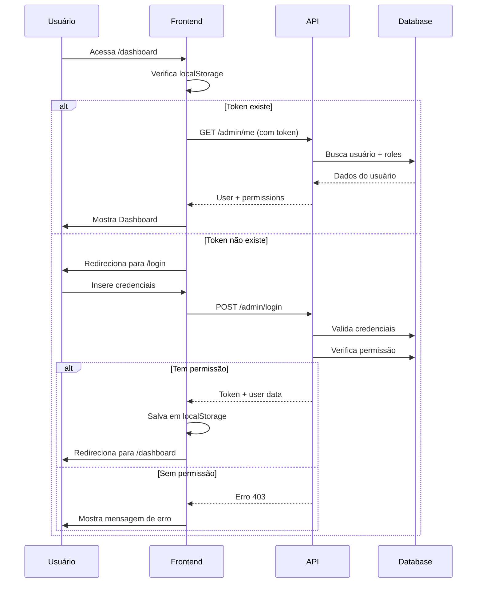

# Painel Administrativo ReadBible - Resumo de Implementação

## 📋 Visão Geral

Painel administrativo web completo com sistema de autenticação baseado em roles e permissões, integrado ao backend AdonisJS existente.

## ✅ Componentes Implementados

### Backend (AdonisJS)

#### 1. Database Schema
- **Tabela `roles`**: Armazena papéis do sistema (Administrador, Editor, Usuário)
- **Tabela `user_roles`**: Relacionamento many-to-many entre usuários e roles
- **Migrations**: Criadas e prontas para execução

#### 2. Models
- **Role Model** (`/api/app/models/role.ts`):
  - Serialização JSON para campo `permissions`
  - Relacionamento ManyToMany com User
  
- **User Model** (`/api/app/models/user.ts`):
  - Relacionamento ManyToMany com Role
  - Métodos: `hasPermission()`, `hasAnyPermission()`, `hasAllPermissions()`

#### 3. Seeders
- **Role Seeder** (`/api/database/seeders/role_seeder.ts`):
  - 3 roles pré-configuradas com permissões específicas
  - Administrador: 7 permissões (acesso total)
  - Editor: 4 permissões (acesso limitado)
  - Usuário: 0 permissões (apenas app mobile)

#### 4. Controllers
- **Admin/AuthController** (`/api/app/controllers/Admin/auth_controller.ts`):
  - `POST /admin/login`: Autenticação com verificação de permissão
  - `POST /admin/logout`: Invalidação de token
  - `GET /admin/me`: Dados do usuário autenticado com roles e permissões

#### 5. Routes
- **Admin Routes** (`/api/start/routes.ts`):
  - Grupo `/admin` com endpoints de autenticação
  - Middleware de autenticação em rotas protegidas

#### 6. Commands
- **create:admin** (`/api/commands/create_admin_user.ts`):
  - Comando CLI para criar usuário administrador de teste
  - Credenciais padrão: `admin@readbible.com` / `Admin@123`

### Frontend (React + Vite)

#### 1. Serviços
- **API Client** (`/admin/src/services/api.ts`):
  - Instância Axios configurada
  - Interceptor de requisição: Adiciona Bearer token automaticamente
  - Interceptor de resposta: Trata erros 401 (auto-logout)

- **Auth Service** (`/admin/src/services/authService.ts`):
  - Funções: `login()`, `logout()`, `me()`
  - Métodos de verificação de permissões
  - Gerenciamento de localStorage

#### 2. Context & State
- **AuthContext** (`/admin/src/contexts/AuthContext.tsx`):
  - Provider React Context para estado global de autenticação
  - Hook customizado: `useAuth()`
  - Carregamento automático de usuário ao montar

#### 3. Componentes
- **ProtectedRoute** (`/admin/src/components/ProtectedRoute.tsx`):
  - HOC para proteger rotas por permissão
  - Loading state enquanto verifica autenticação
  - Tela de "Acesso Negado" para permissões insuficientes

#### 4. Páginas
- **Login** (`/admin/src/pages/Login.tsx` + `Login.css`):
  - Formulário de email/password
  - Validação e exibição de erros
  - Design moderno com gradiente roxo
  - Loading state durante autenticação

- **Dashboard** (`/admin/src/pages/Dashboard.tsx` + `Dashboard.css`):
  - Exibição de dados do usuário (nome, roles, permissões)
  - Header com logout
  - Welcome card com badges de roles e grid de permissões
  - 4 cards placeholder para futuras funcionalidades

#### 5. Configuração
- **App.tsx** (`/admin/src/App.tsx`):
  - React Router configurado
  - AuthProvider envolvendo toda aplicação
  - Rotas: `/login`, `/dashboard`, `/` (redirect)

- **Environment** (`/admin/.env`):
  - `VITE_API_URL=http://localhost:3333`
  - Adicionado ao `.gitignore`

#### 6. Documentação
- **README.md** (`/admin/README.md`):
  - Guia completo de uso
  - Estrutura do projeto
  - Instruções de desenvolvimento
  - Credenciais de teste

## 🔐 Sistema de Permissões

### Roles Disponíveis

| Role | Slug | Permissões |
|------|------|------------|
| **Administrador** | `administrador` | acessar_painel_administrativo, gerenciar_usuarios, gerenciar_conteudo, gerenciar_questionarios, visualizar_relatorios, gerenciar_roles, configurar_sistema |
| **Editor** | `editor` | acessar_painel_administrativo, gerenciar_conteudo, gerenciar_questionarios, visualizar_relatorios |
| **Usuário** | `usuario` | _(sem permissões administrativas)_ |

### Permissão Crítica

`acessar_painel_administrativo` - **Obrigatória** para fazer login no painel. Sem ela, o usuário recebe erro de autenticação.

## 🛠️ Comandos para Iniciar

### Backend
```bash
cd api
node ace migration:run          # Criar tabelas
node ace db:seed                # Popular roles
node ace create:admin           # Criar usuário teste
npm run dev                     # Iniciar backend
```

### Frontend
```bash
cd admin
npm install                     # Instalar dependências
npm run dev                     # Iniciar frontend
```

## 📊 Fluxo de Autenticação



## 📁 Estrutura de Arquivos Criados/Modificados

### Backend
```
api/
├── database/
│   ├── migrations/
│   │   ├── 1767416473426_create_create_roles_table.ts [NOVO]
│   │   └── 1767416506386_create_create_user_roles_table.ts [NOVO]
│   └── seeders/
│       └── role_seeder.ts [NOVO]
├── app/
│   ├── models/
│   │   ├── role.ts [NOVO]
│   │   └── user.ts [MODIFICADO - adicionou relacionamento com roles]
│   └── controllers/
│       └── Admin/
│           └── auth_controller.ts [NOVO]
├── commands/
│   └── create_admin_user.ts [NOVO]
└── start/
    └── routes.ts [MODIFICADO - adicionou rotas /admin/*]
```

### Frontend
```
admin/
├── src/
│   ├── components/
│   │   └── ProtectedRoute.tsx [NOVO]
│   ├── contexts/
│   │   └── AuthContext.tsx [NOVO]
│   ├── pages/
│   │   ├── Login.tsx [NOVO]
│   │   ├── Login.css [NOVO]
│   │   ├── Dashboard.tsx [NOVO]
│   │   └── Dashboard.css [NOVO]
│   ├── services/
│   │   ├── api.ts [NOVO]
│   │   └── authService.ts [NOVO]
│   └── App.tsx [MODIFICADO - adicionou rotas e AuthProvider]
├── .env [NOVO]
├── .gitignore [MODIFICADO - adicionou .env]
└── README.md [MODIFICADO - documentação completa]
```

### Documentação
```
/
├── ADMIN_PANEL_TEST_GUIDE.md [NOVO]
└── .github/
    └── copilot-instructions.md [ATUALIZADO]
```

## 🎯 Funcionalidades Prontas para Uso

- ✅ Sistema de login com validação
- ✅ Verificação de permissões baseada em roles
- ✅ Dashboard com informações do usuário
- ✅ Exibição de roles e permissões
- ✅ Logout com limpeza de sessão
- ✅ Proteção de rotas por permissão
- ✅ Auto-logout em caso de token inválido (401)
- ✅ Loading states durante autenticação
- ✅ Tratamento de erros de API
- ✅ Design responsivo e moderno
- ✅ Comando CLI para criar usuário admin

## 🚀 Próximos Passos Sugeridos

1. **Gerenciamento de Usuários**
   - Listagem com paginação
   - Criação/Edição/Exclusão
   - Atribuição de roles

2. **Gerenciamento de Roles**
   - CRUD completo de roles
   - Editor visual de permissões

3. **Gerenciamento de Conteúdo**
   - Livros bíblicos
   - Planos de leitura
   - Harpas e músicas

4. **Gerenciamento de Questionários**
   - Criação/Edição de quizzes
   - Revisão de respostas
   - Estatísticas de desempenho

5. **Relatórios e Dashboard**
   - Gráficos de uso do app
   - Estatísticas de leitura
   - Ranking de usuários

## 🔍 Como Testar

Siga o guia detalhado em: **`ADMIN_PANEL_TEST_GUIDE.md`**

Credenciais de teste:
- **Email**: `admin@readbible.com`
- **Senha**: `Admin@123`

## 📝 Notas Técnicas

- **Token Expiration**: 7 dias (configurado no backend)
- **Storage**: localStorage (chaves: `admin_token`, `admin_user`)
- **API Base URL**: `http://localhost:3333` (configurável via `.env`)
- **Frontend Port**: `5173` (padrão Vite)
- **Authentication**: Bearer Token JWT

## 🐛 Troubleshooting

Consulte a seção "Troubleshooting" em `ADMIN_PANEL_TEST_GUIDE.md` para problemas comuns e soluções.
